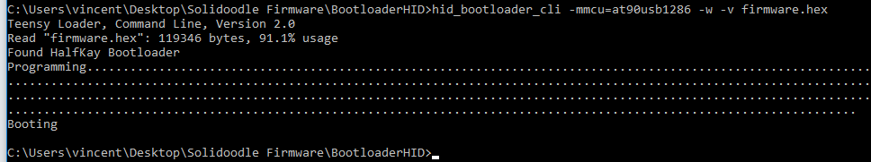

# Solidoodle 2 /3 Firmware (2018-03-17)

By Vladimir S. Udartsev [udartsev.ru](http://udartsev.ru)
###### Based on [Marlin 1.1.8](http://marlinfw.org) (DEC2017)<br>
###### Compiled via [marlin-conf](https://github.com/akaJes/marlin-config/releases)
<hr>

## What is inside
1. Firmware
- *solidoodle2.hex* (no LED, no LCD, no SDCARD) (150x150 board)
- *solidoodle3.hex* (no LED, no LCD, no SDCARD) (200x200 board)
- Official Solidoodle 2/3 fw, based on marlin_1.0 (2014)

2. Software for Win10_x64
- BootloaderHID (HalfKay Bootload)
- marlin-conf

## Install
~~For Windows 10 x64:~~
1. Download and Install [*marlin-conf*](https://github.com/akaJes/marlin-config/releases)
2. Download and Install [Python 2.7.14](https://www.python.org/downloads/)
3. Download and Install [PlatformIO](https://raw.githubusercontent.com/platformio/platformio/develop/scripts/get-platformio.py)
4. Download and Install [GIT](https://git-scm.com/download/win)
5. Download and Install [Notepad++](https://notepad-plus-plus.org/download/v7.5.5.html) does not nessosery

## How to use marlin-conf
1. Download and unzip [solidoodle2-marlin_1.0_(2014).7z](https://github.com/udartsev/SolidoodleFirmware/blob/master/Firmware/solidoodle2-marlin_1.0_(2014).7z)
2. Add **Configuration.h** and **Configuration_adv.h** to the project (just drag&drop it into the window)
3. Define constants for your 3D printer motherboard. For Solidoodle 2 and Solidoodle 3 select **PRINTRBOARD (81)** MOTHERBOARD
```
#define MOTHERBOARD  81
#define TEMP_SENSOR_0 6
```
4. Just change your data as you like.
5. Select **PRINTRBOARD** in *COMPILE* option, and turn *COMPILE* button
6. Copy **firmware.hex** file into *BootloaderHID* folder

## How to use BootloaderHID
1. Download [BootloaderHID](https://www.obdev.at/products/vusb/bootloadhid.html)
2. Plugin your Printrboard (Solidoodle) motherboard via USB cable (and 12V cable if exist)
3. Add a jumper to the BOOT pins on the printboard (back of the printer), then press the RESET button
4. Copy compiled **firmware.hex** file into *BootloaderHID* folder.
5. Rund windows command line (**cmd**)
6. Enter *BootloaderHID* folder (*cd C://BootloaderHID-folder*)
7. Run command:
```
hid_bootloader_cli -mmcu=at90usb1286 -w -v firmware.hex
```
<br>
###### Marlin Configure screenshot


###### Solidoodle2 PRINTRBOARD screenshot


###### BootloaderHID success fw uload screenshot


