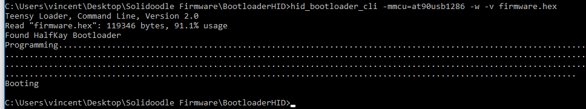

# BootloaderHID for Win10_x64

## How to use BootloaderHID
1. Plugin your Printrboard (Solidoodle) motherboard via USB cable (and 12V cable if exist)
2. Add a jumper to the BOOT pins on the printboard (back of the printer), then press the RESET button
3. Copy compiled **firmware.hex** file into *BootloaderHID* folder.
4. Rund windows command line (**cmd**)
5. Enter *BootloaderHID* folder (*cd C://BootloaderHID-folder*)
6. Run command:
```
hid_bootloader_cli -mmcu=at90usb1286 -w -v firmware.hex
```

